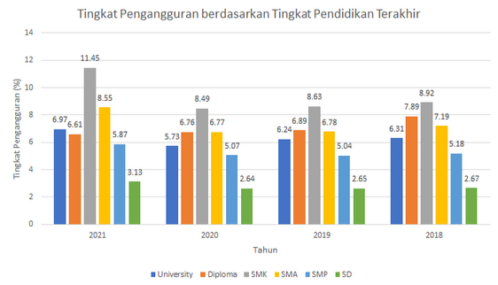
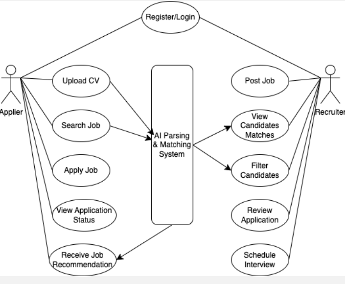
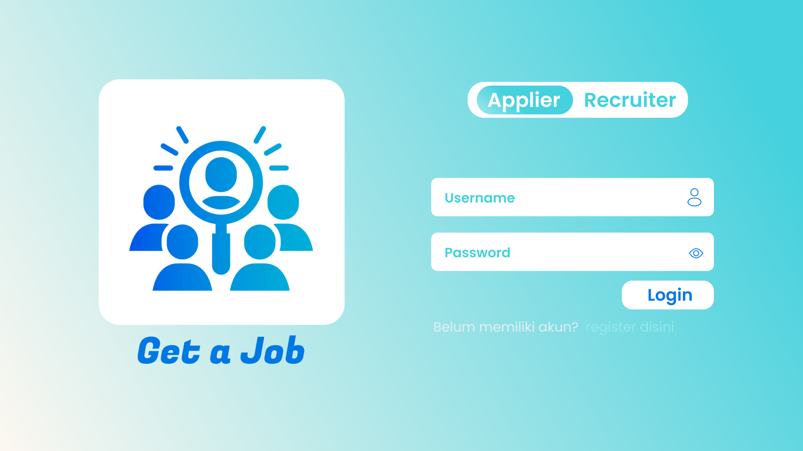
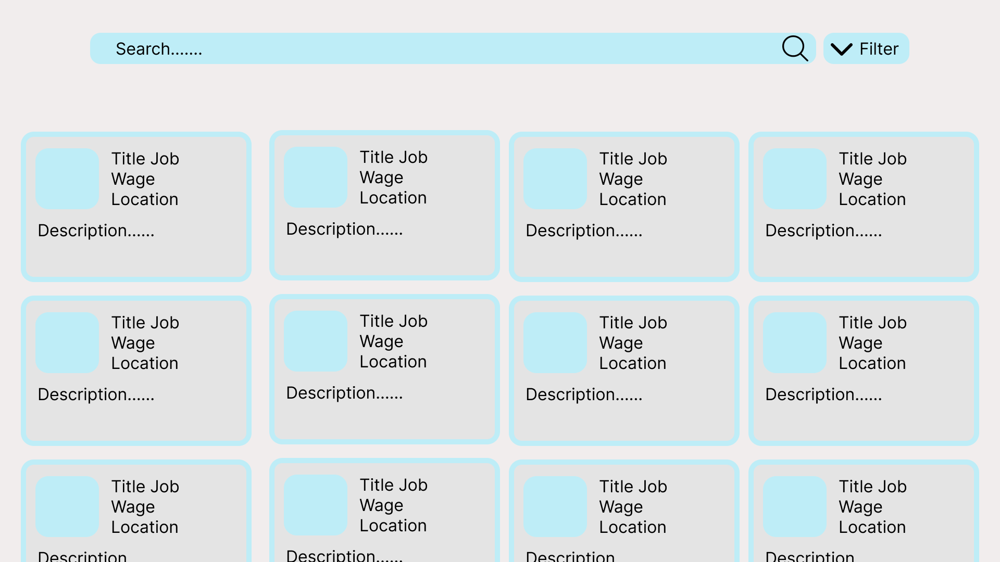
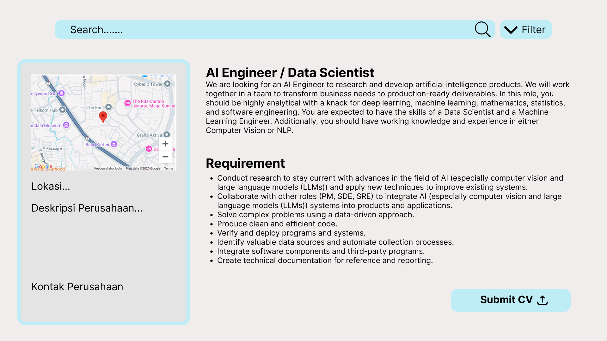
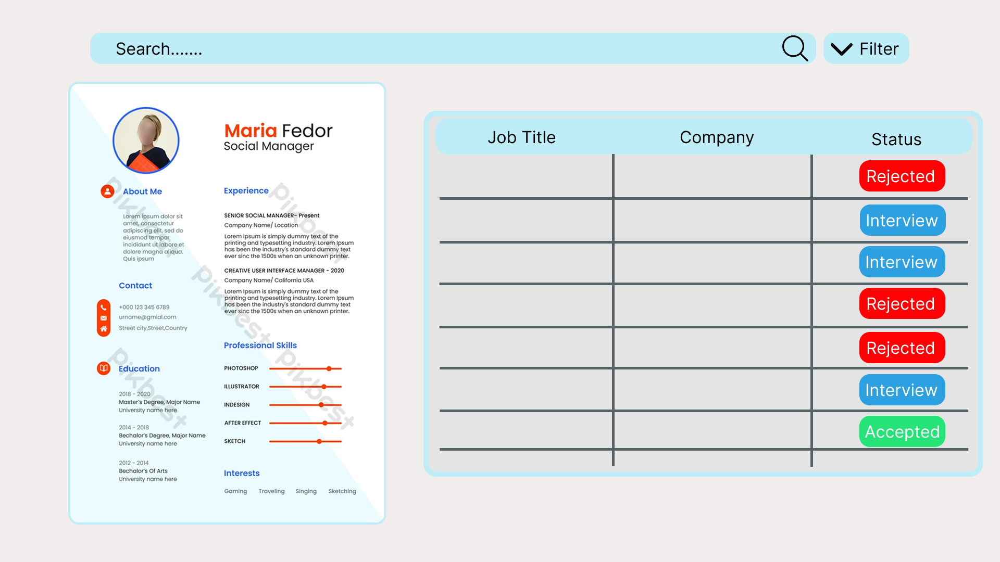
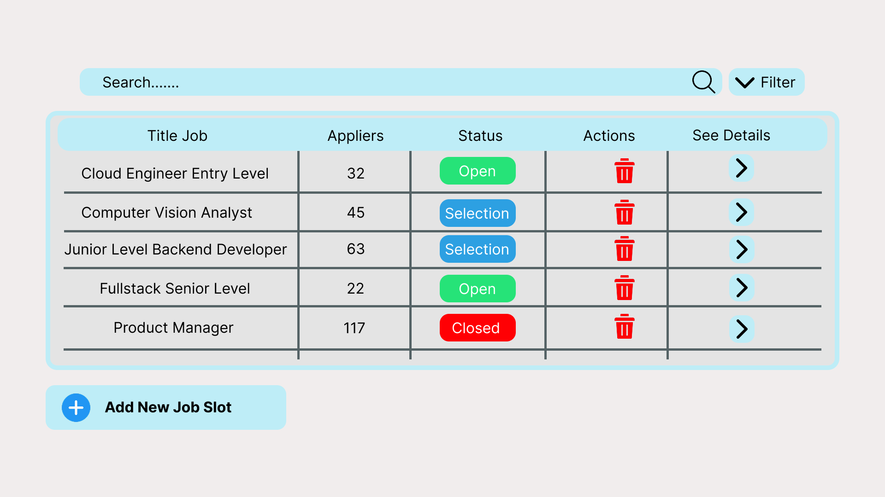
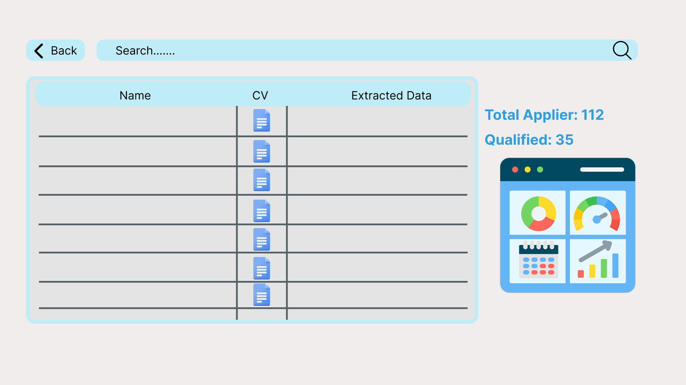
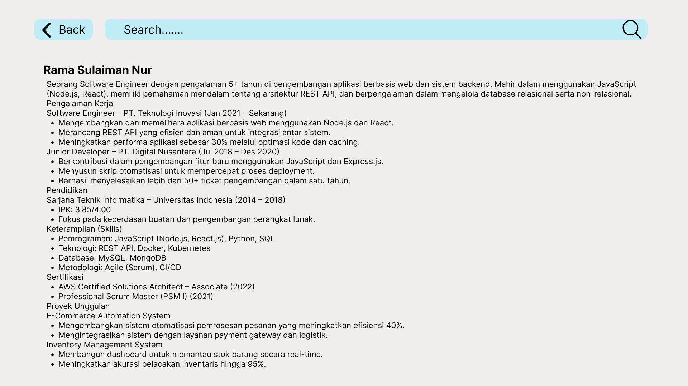
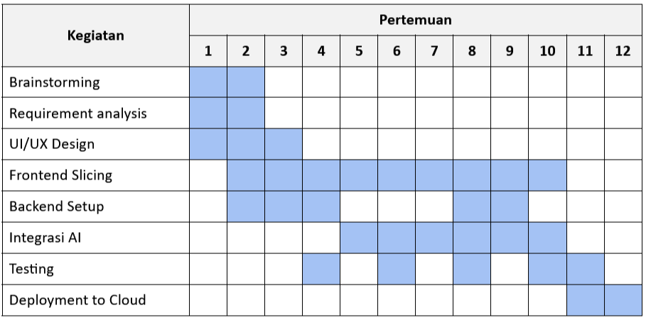

# GetaJob

Nama Kelompok: Get A Job (Kelompok 02 Kelas B1)  
Anggota:

1. Rama Sulaiman Nurcahyo - 22/492727/TK/53940
2. Flavia Hidayriamraata Pualam - 22/494376/TK/54219
3. Muhammad Hilmi Dzaki Wismadi - 22/497591/TK/54539

**Project Senior**  
**Departemen Teknologi Elektro dan Teknologi Informasi, Fakultas Teknik, Universitas Gadjah Mada**  
**Nama Produk: GetaJob**
**Jenis Produk: Layanan aplikasi Job-seeking**

---

## Modul 1

### Latar Belakang:

Rekrutmen merupakan sebuah metode penjaringan para calon tenaga kerja baru pada sebuah perusahaan atau tempat bekerja dengan melewati segala tahapan-tahapan yang telah diberikan oleh perusahaan [1]. Dalam prosesnya, rekrutmen dapat menggunakan media komunikasi sehingga perekrutan dapat dilaksanakan dengan lebih menghemat waktu dan tenaga guna mendapatkan tenaga kerja yang sesuai dengan kebutuhan perusahaan [2].

Salah satu sumber informasi pekerjaan terdapat pada pemberitaan dari surat kabar. Dengan perkembangan teknologi di era modern ini, masyarakat berharap agar tersedia fasilitas lowongan pekerjaan yang dapat mempermudah mereka sehingga masyarakat tidak harus mendatangi sumber informasi lowongan pekerjaan (misalnya mendatangi POS). Selain itu, masyarakat berharap bahwa terdapat fasilitas yang dapat membantu mereka dalam proses pelamaran kerja [1].

Di sisi lain, dilihat dari sudut sisi pemberi kerja, terdapat banyak perusahaan – perusahaan dan UMKM yang mengalami kesulitan dalam masa perekrutan dan seleksi pegawai barunya. Dimulai dari saat proses penyebaran informasi yang membutuhkan banyak biaya, sampai saat penyeleksian calon karyawan yang tidak sesuai dengan kriteria perusahaan.
Hampir seluruh perusahaan besar telah memiliki biaya untuk mengakomodasi pengiklanan melalui berbagai media [3]. Namun, perusahaan kecil hingga UMKM tidak memiliki fasilitas tersebut. Terlebih lagi, perusahaan besar cenderung hanya mengincar seseorang dengan pendidikan di atas sarjana. Hal ini mempersulit seseorang di tingkat pendidikan lebih rendah untuk menemukan sumber informasi pekerjaan untuknya.

### Rumusan Permasalahan:

1. Bagaimana cara membuat sebuah sistem yang dapat mempermudah masyarakat mencari pekerjaan?
2. Bagaimana cara membuat sumber informasi pekerjaan bagi seluruh kalangan masyarakat?
3. Bagaimana cara membuat sebuah sistem yang dapat mempermudah perusahaan dan UMKM dalam mencari tenaga kerja?

### Ide/Solusi:

Platform yang mengotomatiskan proses pencarian kerja dan seleksi kandidat untuk job seekers dan recruiters. Dengan teknologi AI Resume Parsing & Matching, sistem dapat mengekstrak informasi dari CV, mencocokkannya dengan lowongan pekerjaan yang sesuai, serta membantu perusahaan dalam menyaring kandidat secara efisien.

### Fitur:

Integrasi dengan Automatic PDF Extractor: Sistem AI yang secara otomatis mengubah CV ke format yang lebih rapi dan terstruktur, memudahkan HR membandingkan kandidat.  
Menilai Lamaran Calon Pekerja: Sistem AI yang secara otomatis menunjukkan nilai kesesuaian lamaran calon pekerja dengan deskripsi pekerjaan.  
Cari Pekerjaan: Fitur bagi calon tenaga kerja untuk melihat berbagai lowongan pekerjaan untuk langsung melamar pekerjaan dengan dashboard yang interaktif.  
Melamar Pekerjaan: CV cukup diunggah sekali dan bisa melamar ke banyak pekerjaan.  
Memposting Lowongan Pekerjaan: Fitur bagi perusahaan dan UMKM untuk menuliskan pekerjaan beserta deskripsinya.

### Analisis Kompetitor:

#### Kompetitor 1

Nama: Torre.ai  
Jenis Kompetitor: Indirect  
Jenis Produk: Sistem manajemen HR berbasis AI  
Target Customer: Perusahaan korporat besar yang sudah memerlukan otomasi dalam AI  
Kelebihan: Memiliki fitur yang lebih advance, Reputasi dan gathering data yang lebih lengkap  
Kekurangan: Hanya cocok untuk perusahaan besar, Perlu penggunaan tools untuk berkepanjangan  
Key Competitive Advantage & Unique Value: Proses end-to-end yang tidak hanya berjalan saat recruitment namun juga positioning yang berlangsung dalam perusahaan sehingga employee bisa ditempatkan sesuai perkembangan skill dan karir mereka

#### Kompetitor 2

Nama: Career Catapa  
Jenis Kompetitor: Direct  
Jenis Produk: Website job market  
Target Customer: Pihak yang membutuhkan job market  
Kelebihan: Mudah digunakan dan user friendly, Akses gratis  
Kekurangan: Belum menerapkan AI secara maksimal  
Key Competitive Advantage & Unique Value: Memberi kemudahan akses kepada applier untuk mencari job market

#### Kompetitor 3

Nama: HireVue  
Jenis Kompetitor: Direct  
Jenis Produk: Sistem rekrutmen  
Target Customer: korporat besar yang membutuhkan hiring process yang tergolong advance  
Kelebihan: Fitur advance seperti interview dengan AI analisis, Skalabilitas volume hiring yang tinggi  
Kekurangan: Terlalu mahal untuk UMKM, AI Bias terhadap etnis  
Key Competitive Advantage & Unique Value: AI yang terintegrasi tidak hanya CV namun juga tahap interview sehingga dapat membuat keputusan direktur yang lebih matang

## Daftar Pustaka

[1] R. P. Kurnia, Y. J. Sy, W. F. Zalmi, “Perancangan Job Seeker – Aplilasi [sic] Pencari Kerja Menggunakan PHP dan MYSQL,” JOSTECH: Journal of Science and Technology, vol. 4, no. 1, 87 - 96, 2024.  
[2] M. T. Parinsi, V. R. Palilingan, O. Kembuan, K. F. Ratumbuisang, “Job seeker information system using online web based and android mobile phones,” IOP Conf. Series: Materials Science and Engineering 830 (2020) 022093, 2019, doi:10.1088/1757-899X/830/2/022093  
[3] J. S. Asa, O. Bumma, D. Tamara, C. M. Sarungu, “Android Based Job Search Application “Megawe” for The Segment of Workers with an Education Level Below a University Degree,” 8th International Conference on Computer Science and Computational Intelligence (ICCSCI 2023), 194 - 203, 2023.

## Modul 2

### Metodologi SDLC

Metodologi yang digunakan: Pada proyek kamu mengimplementasikan penggunaan metodologi Agile Scrum
Alasannya:

- Penggunaan Scrum Framework sehingga pengembangan dan perilisan fitur dapat dibagi pada sprint
- Fleksibel terhadap perubahan apabila terdapat kebutuhan requirement saat pengembangan
- Mengintegrasikan fitur secara bertahap sehingga dapat meminimalisir resiko karena pengujian dan validasi setiap tahap

### Perancangan tahap 1 - 3 SDLC

1. **Tujuan dari produk**

   - Mempercepat proses rekrutmen dengan otomatisasi screening dan pencocokan kandidat menggunakan AI.
   - Meningkatkan akurasi dalam menilai dan mencocokkan kandidat sesuai kualifikasi yang dibutuhkan.
   - Menyederhanakan pengalaman bagi pelamar kerja dan perusahaan melalui sistem yang efisien dan mudah digunakan.

2. **Pengguna potensial dari produk dan kebutuhan para pengguna tersebut**

   - **Perusahaan (HR dan Rekruter)**  
     **Kebutuhan:** Menyaring dan menilai kandidat secara cepat dan akurat, mengurangi beban kerja manual, dan mempercepat proses perekrutan.
   - **Pelamar Kerja (Job Seekers)**  
     **Kebutuhan:** Mendapatkan rekomendasi pekerjaan yang sesuai, mempermudah proses pengiriman lamaran, dan meningkatkan peluang diterima melalui CV yang dioptimalkan.
   - **Startup dan UMKM**  
     **Kebutuhan:** Akses ke alat rekrutmen yang terjangkau dan otomatis untuk menemukan kandidat berkualitas tanpa memiliki tim HR yang besar.

3. **Use Case diagram**
   

4. **Functional requirements untuk use case yang telah dirancang**

   | FR                           | Deskripsi                                                                                                                     |
   | ---------------------------- | ----------------------------------------------------------------------------------------------------------------------------- |
   | Register/Login               | Sistem memungkinkan pengguna untuk membuat akun atau masuk ke akun yang telah dibuat dengan username dan password             |
   | Upload CV                    | Sistem memungkinkan Applier untuk mengunggah CV                                                                               |
   | Search Job                   | Sistem memungkinkan Applier untuk mencari pekerjaan                                                                           |
   | Apply Job                    | Sistem memungkinkan Applier untuk melamar pekerjaan                                                                           |
   | View Application Status      | Sistem memungkinkan Applier untuk melihat status lamaran pekerjaan mereka                                                     |
   | Receive Job Recommendation   | Sistem memberikan rekomendasi pekerjaan yang sesuai dengan Applier berdasarkan CV                                             |
   | Post Job                     | Sistem memungkinkan Recruiter untuk memposting lowongan pekerjaan                                                             |
   | View Candidates Matches      | Sistem memungkinkan Recruiter untuk melihat kandidat yang cocok dengan lowongan pekerjaan berdasarkan sistem pencocokan       |
   | Filter Candidates            | Sistem memungkinkan Recruiter untuk memfilter kandidat berdasarkan kriteria tertentu                                          |
   | Review Application           | Sistem memungkinkan Recruiter untuk mereview lamaran kerja yang diajukan oleh Applier                                         |
   | Schedule Interview           | Sistem memungkinkan Recruiter untuk menentukan jadwal wawancara dengan kandidat terpilih                                      |
   | AI Parsing & Matching System | Sistem menggunakan teknologi AI untuk mengekstrak data dari CV dan mencocokkan kandidat dengan lowongan pekerjaan yang sesuai |

5. **Entity Relationship Diagram**
   
6. **Low-fidelity Wireframe**
   Link: [Lo-fi Wireframe](https://www.figma.com/design/NZVaTCmaFTqb4o9PoBJ0Bk/SenPro?node-id=1-3&t=x75r4jDMdxy2eIj3-1)
   
   
   
   
   
   
   

7. **Gantt-Chart pengerjaan proyek dalam kurun waktu 1 semester**
   
